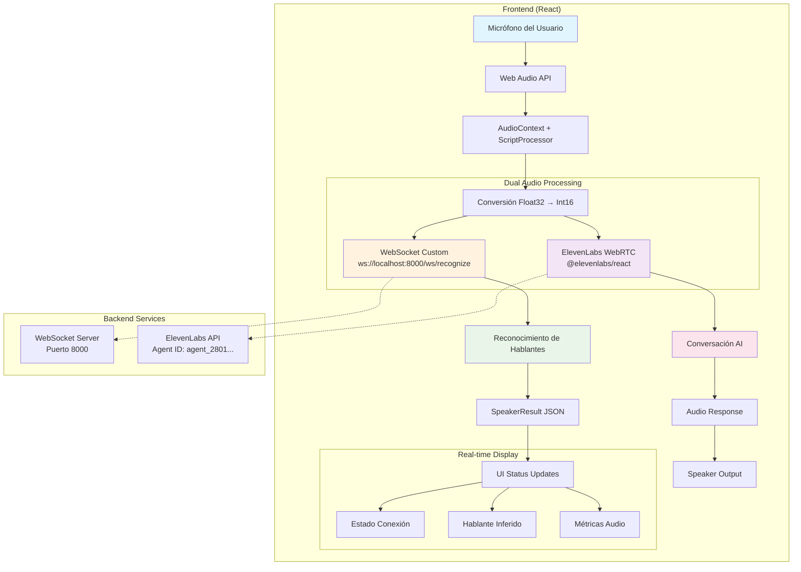

# Alicia v1

Sistema de reconocimiento de hablantes en tiempo real con conversación AI usando ElevenLabs y WebSocket custom.

## 🚀 Instalación

### Prerequisitos
- Node.js 18+ 
- pnpm (recomendado) o npm

### Pasos de instalación
```bash
# Clonar el repositorio
git clone <repository-url>
cd alicia-v1

# Instalar dependencias
pnpm install
# o con npm: npm install

# Ejecutar en modo desarrollo
pnpm dev
# o con npm: npm run dev
```

## 📋 Scripts Disponibles

- `pnpm dev` - Iniciar servidor de desarrollo
- `pnpm build` - Compilar para producción (ejecuta TypeScript primero)
- `pnpm lint` - Ejecutar ESLint
- `pnpm preview` - Previsualizar build de producción

## 🏗️ Arquitectura

### Flujo de Audio Bidireccional



## 📁 Estructura de Archivos

### Archivos Principales

| Archivo | Descripción |
|---------|-------------|
| `src/App.tsx` | Componente principal con layout animado y orbe |
| `src/components/conversation.tsx` | Interface de conversación con ElevenLabs y estados |
| `src/hooks/use-agent-conversation.ts` | Hook para gestión de conversación dual (ElevenLabs + WebSocket) |
| `src/hooks/use-speaker-recognition.ts` | Hook WebSocket para reconocimiento de hablantes |
| `src/constants/index.ts` | URLs WebSocket y configuración API |

### Tipos y Utilidades

| Archivo | Descripción |
|---------|-------------|
| `src/types/recognition.ts` | Tipos TypeScript para resultados de reconocimiento |
| `src/types/elevenlabs.ts` | Tipos para integración ElevenLabs |
| `src/lib/utils.ts` | Utilidades Tailwind CSS |

### Componentes UI

| Archivo | Descripción |
|---------|-------------|
| `src/components/animated-orb.tsx` | Orbe animado central |
| `src/components/gradient-layout.tsx` | Layout con gradientes |
| `src/components/ui/button.tsx` | Componente botón reutilizable |

## 🔧 Configuración

### WebSocket Backend
- **URL**: `ws://localhost:8000/ws/recognize`
- **Formato Audio**: Int16 PCM, 16kHz, mono
- **Protocolo**: Envía audio binario, recibe JSON

### ElevenLabs
- **Agent ID**: `agent_2801k1gq1rxnem5s81sjspd04ggr`
- **Conexión**: WebRTC
- **SDK**: `@elevenlabs/react`

## 🎯 Funcionalidades

### Reconocimiento de Hablantes
- Conexión WebSocket en tiempo real
- Procesamiento audio Int16 PCM
- Identificación de hablante inferido
- Métricas de confianza y umbral de activación

### Conversación AI
- Integración ElevenLabs Conversational AI
- Respuestas de voz en tiempo real
- Estados de conexión visuales
- Indicadores de actividad del agente

### Interface de Usuario
- Animaciones fluidas con Framer Motion
- Gradientes dinámicos
- Estados de conexión en tiempo real
- Diseño responsive con Tailwind CSS v4

## 🛠️ Stack Tecnológico

- **Frontend**: React 19 + TypeScript + Vite
- **Styling**: Tailwind CSS v4 + Geist Font
- **Audio**: Web Audio API + ScriptProcessor
- **AI**: ElevenLabs React SDK
- **WebSocket**: Conexión nativa JavaScript
- **Animaciones**: Framer Motion
- **Build**: Vite con SWC